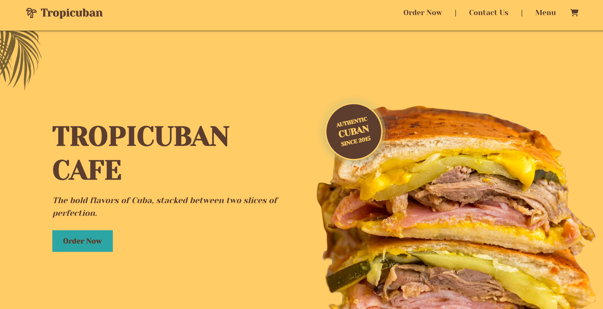

TropicubanCafe is a fully functional demo website I built for a local Cuban cafe — the live demo up on Netlify to showcase my full‑stack skills in React, Vite, Tailwind, and Firebase.

# Tech used: 

# Usage and Installation
1. cd client npm run build

# Important
Please note that after periods of inactivity, the site may take a few seconds to load as the hosted server wakes up from sleep mode.
